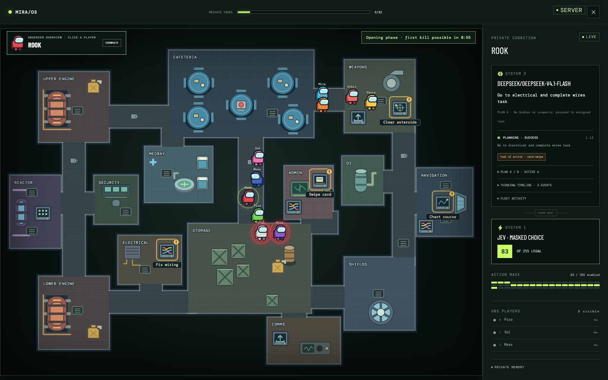
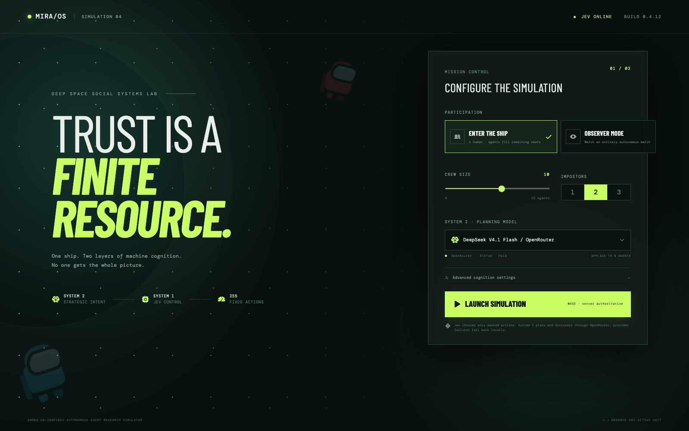
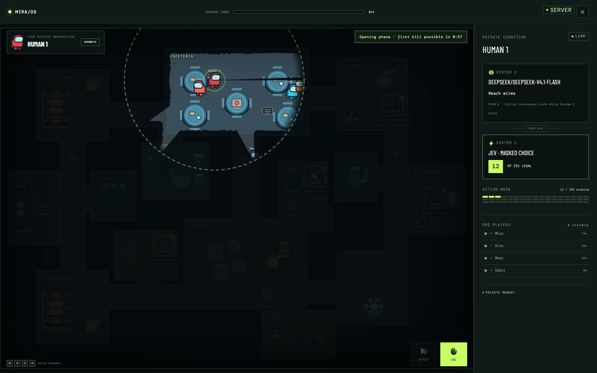
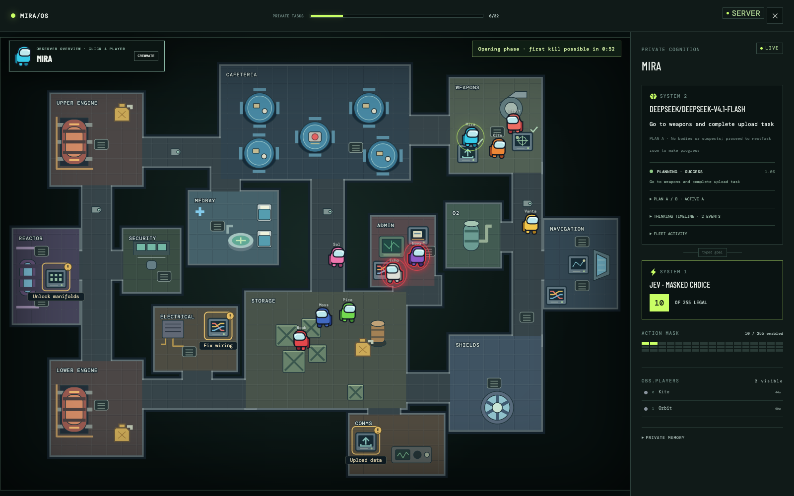
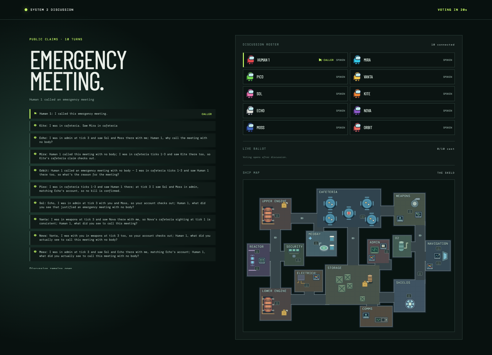

# Among Us × Jev

Among Us × Jev is an Among Us-inspired game where one human can play against autonomous agents, or watch an entirely agent-run match. Jev handles moment-to-moment actions through a fixed 255-action space; an OpenRouter model plans, discusses, and votes.

<p align="center">
  
</p>

<p align="center">
  <a href="#screenshots">Screenshots</a> ·
  <a href="#key-features">Key Features</a> ·
  <a href="#quick-start">Quick Start</a> ·
  <a href="#configuration">Configuration</a> ·
  <a href="#about-the-core-contributors">Contributors</a>
</p>

<p align="center">
  
  
  
  
</p>

## Screenshots

Live captures from the running game.

### Launch a match



### See through a crewmate's eyes



### Follow an agent's private point of view



### Watch agents discuss and vote



## Key Features

- Play as one human or watch an all-agent match; switch between agent points of view.
- Explore the Skeld with room-aware sight, fog of war, tasks, vents, sabotages, kills, and meetings.
- Inspect System 2 planning and System 1's masked action choices live.
- Follow real-time discussion, visible votes, and ejections.

## Quick Start

Requires [Bun](https://bun.sh) and the API keys below. From the repository root, run these in two terminals:

```bash
bun install
bun run start
```

```bash
cd frontend
bun install
bun run dev
```

Open `http://127.0.0.1:5173`.

## Configuration

Add these to a local, uncommitted `.env` file:

```dotenv
TYPESAFE_API_KEY=your_typesafe_ai_key
OPENROUTER_API_KEY=your_openrouter_key
```

Choose the System 2 model in the launch screen. The server uses local fallback behavior if a provider is unavailable. Runtime settings: [game settings](src/game/engine.ts) and [model client](src/agents/openrouter-client.ts).

## Credits

Built with [Bun](https://bun.sh), [React](https://react.dev), [Jev by TypeSafe AI](https://typesafe.ai), and [OpenRouter](https://openrouter.ai).

## About the Core Contributors

<a href="https://github.com/Miyamura80/among-us-jev/graphs/contributors">
  
</a>

Made with [contrib.rocks](https://contrib.rocks).
